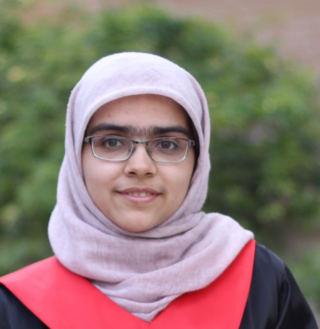



# About This Course

   
 
 
            
  

   <h1>
    Course instructor
   </h1>
   

    

     
     
Mohammad Taher Pilehvar

    

   

  

 

 
  
 
 
        
 
  

   <h1>
    Teaching Assistants
   </h1>
   

    

     
     
Mehrdad Nasser

    

    
    

     
     
Zahra Delbari

    

   

   

   

   
       
  
  
        
 
  

   <h1>
    Project Mentors
   </h1>
   

    

     
     
Kave Eskandari

    

    

     
     
Mahdi Zakizadeh

    

   

   

   

   
 
 

